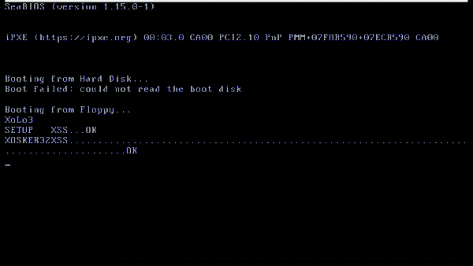

# X-OS: A Hobby Operating System

[](https://opensource.org/licenses/MIT)
[]()

A dual-mode operating system developed between 1999-2004 as a learning project to understand Intel x86 architecture and operating system internals.



## 🎯 Project Background

This project was started when I was 16 years old with the goal of learning:
- Intel x86 CPU architecture (386+)
- Operating system design principles  
- Low-level hardware programming
- Memory management and virtual memory
- Process scheduling and multitasking

After 27 years, I've updated the build system to work with modern compilers and am now sharing this educational project with the community.

The original code comments are in French, I've kept them in French for historical reasons and added English comments for modernization.

## ✨ Features

### Core System
- **Dual-mode operation**: 16-bit real mode and 32-bit protected mode
- **Custom bootloader**: FAT12-compatible boot sector
- **Memory management**: Paging with 4KB pages, custom allocator
- **Multitasking**: TSS-based hardware task switching
- **Interrupt handling**: Custom IDT with hardware interrupt support

### Hardware Support
- **Storage**: Floppy disk driver with FAT12 filesystem
- **Input**: PS/2 keyboard with multiple keymaps (French/English)
- **Display**: VGA text mode, VESA graphics (640x480x256)
- **System**: Timer, PIC programming, A20 line handling

### Software
- **Modular shell system**: Switchable command interpreters
- **Built-in debugger**: Memory inspection, GDT analysis
- **File operations**: Directory listing, file loading
- **System utilities**: Memory info, hardware detection


>Note: The Bootloader loads 32-bit kernel by default, if you want to load 16-bit kernel, you need to edit the bootloader and change the kernel to 16-bit kernel.

## 🚀 Quick Start

### Prerequisites

#### Required Packages
The following packages are required to build and run X-OS:

| Package | Purpose | Ubuntu Package |
|---------|---------|----------------|
| **NASM** | Assembly code compilation | `nasm` |
| **GCC** | C code compilation | `gcc` |
| **Make** | Build system | `make` |
| **dosfstools** | FAT12 filesystem creation | `dosfstools` |
| **mtools** | DOS filesystem manipulation | `mtools` |
| **coreutils** | Basic utilities (dd, tar, etc.) | `coreutils` |

#### Optional Packages (for testing)
| Package | Purpose | Ubuntu Package |
|---------|---------|----------------|
| **QEMU** | x86 emulation for testing | `qemu-system-x86` |
| **Bochs** | Alternative x86 emulator | `bochs` |

#### Installation on Ubuntu/Debian
```bash
# Install required build tools
sudo apt update
sudo apt install -y nasm gcc make dosfstools mtools coreutils

# Install optional emulators for testing
sudo apt install -y qemu-system-x86 bochs

# Verify installation
nasm --version
gcc --version
make --version
mkfs.fat --help | head -1
mcopy --version | head -1
qemu-system-i386 --version | head -1
```

#### Installation on Other Distributions

**Fedora/RHEL/CentOS:**
```bash
sudo dnf install nasm gcc make dosfstools mtools coreutils qemu-system-x86
```

**Arch Linux:**
```bash
sudo pacman -S nasm gcc make dosfstools mtools coreutils qemu-arch-extra
```

**Alpine Linux:**
```bash
sudo apk add nasm gcc make dosfstools mtools coreutils qemu-system-i386
```

### Building
```bash
# Clone the repository
git clone https://github.com/yourusername/xos.git
cd xos

# Build the entire system
make compil

# Create a floppy disk image
make image

# Run in Bochs emulator
make runimage
```

### Installation to Physical Floppy
```bash
# Build and install to floppy disk
make install
```

## 📚 Documentation

- [Boot Process](docs/BOOT.md) - Bootloader and system initialization
- [16-bit Kernel](docs/KERNEL16.md) - Real mode kernel documentation  
- [32-bit Kernel](docs/KERNEL32.md) - Protected mode kernel documentation
- [Memory Management](docs/MEMORY.md) - Paging and allocation systems
- [Hardware Drivers](docs/DRIVERS.md) - Device driver documentation
- [Shell System](docs/SHELL.md) - Command interpreter documentation
- [Build System](docs/BUILD.md) - Compilation and installation guide

## 🗂️ Project Structure

```
xos/
├── boot/           # Bootloader and setup code
├── 16b/            # 16-bit real mode components
│   ├── kernel/     # 16-bit kernel
│   ├── shl16/      # 16-bit shell
│   └── include/    # 16-bit headers
├── 32b/            # 32-bit protected mode components
│   ├── kernel32/   # 32-bit kernel
│   ├── mm/         # Memory management
│   ├── drivers/    # Hardware drivers
│   ├── shl32/      # 32-bit shell
│   ├── lib/        # C library functions
│   └── include/    # 32-bit headers
├── config/         # System configuration files
├── logo/           # Boot logo graphics
└── docs/           # Documentation
```

## 🔧 Development History
See [CHANGELOG.md](CHANGELOG.md) for detailed version history.

## 🎓 Educational Value

This project demonstrates:
- **Low-level programming**: Direct hardware manipulation
- **System architecture**: x86 segmentation and paging
- **OS design patterns**: Layered architecture, modularity
- **Development process**: Incremental feature development

## 🤝 Contributing

While this is primarily a historical/educational project, contributions are welcome:
- Documentation improvements
- Build system enhancements  
- Code comments and explanations
- Additional features and hardware support

## 📄 License

This project is licensed under the MIT License - see the [LICENSE](LICENSE) file for details.

**Note:** This project includes some components from the GNU C Library (glibc) which are licensed under LGPL v2.1. See [THIRD_PARTY_LICENSES.md](THIRD_PARTY_LICENSES.md) for details on third-party licenses and compatibility.


## 🙏 Acknowledgments

- Intel x86 architecture documentation
- Various OS development tutorials and books from the late 90s/early 2000s
- The hobbyist OS development community from [osdev.org](https://wiki.osdev.org/Expanded_Main_Page) and [mega-tokyo.com](https://web.archive.org/web/20020607183325/http://www.mega-tokyo.com/os/os-faq.html)

---

*"The best way to understand how something works is to build it yourself."*
